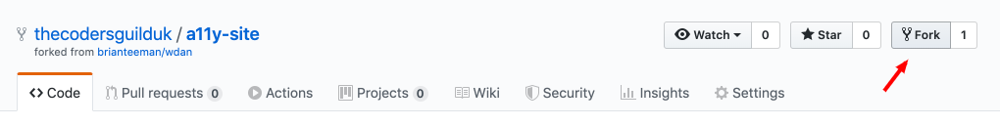
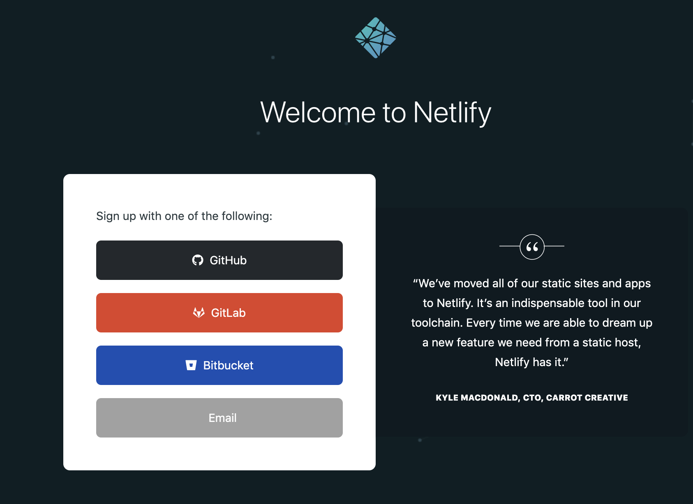
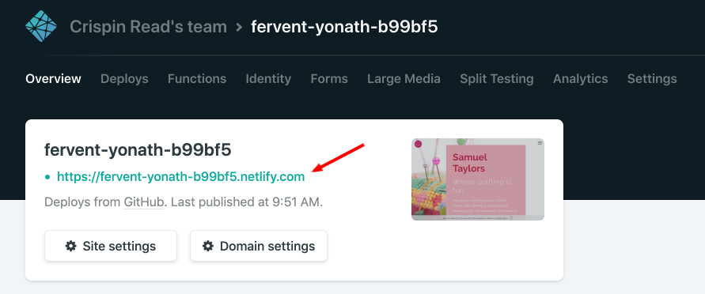
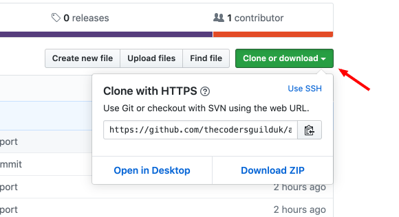

# Web Dev Apprentice Source Control Training

For this session we will be working with Git on a colaborative project.

## QuickStart
1. Fork this repo to your own GitHub account
1. Login to (or sign-up for) Netlify https://app.netlify.com/signup
1. Create a new site from GitHub from the repo you just created
1. Make changes locally and merge them to the master branch on your repo to deploy to your site on Netlify

## More Detailed Set-up Tutorial

### Step 1
First up you need to fork (create a copy) of this repository:

[How to fork a repo on GitHub](https://help.github.com/en/github/getting-started-with-github/fork-a-repo)

### Step 2
Create an account on Netlify to host your site. If you sign up using GitHub all your repositories will be available as soon as you log in.
[Sign-up to Netlify](https://app.netlify.com/signup)

### Step 3
1. Click the 'Create a new site from GitHub' link.
1. Click the GitHub button to choose that as the Git provider
1. Select your a11y-site repo and follow the steps to set up

Your site should now be live at the link provided on your Netlify dashboard:

### Step 4
Clone the repo to your local machine to work on the solutions.

Merge to master and push your changes to see them deployed to your Netlify site.
